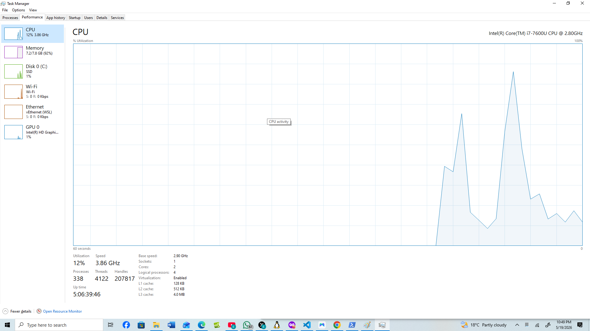

# Day 1: Advanced Infrastructure Audit & Accountability Setup

## Operational Objectives
- Establish an immutable accountability pipeline via GitHub tracking over SSH.
- Audit host machine hardware profiles to calculate virtualization capability boundaries.
- Design a professional, phase-isolated repository namespace structure.

## Technical Execution & Baseline Telemetry
1. **Cryptographic Authentication:** Swapped repository endpoint tracking from HTTPS to asymmetric Ed25519 SSH keys to bypass password deprecation and secure the push stream.
2. **Host OS Mapping:** Identified the host operating system as Windows 10 Pro running the thin utility Hyper-V virtualization layer to pass resource flags to WSL2.
3. **Core Processing Signature:** Processed `lscpu` fields to verify an Intel(R) Core(TM) i7-7600U CPU @ 2.80GHz with active hardware virtualization extensions (VT-x) enabled in the firmware.

## Strategic Constraints Identified
- **The RAM Bottleneck:** Total host memory profile is restricted to 7.4 GiB (8GB physical allocation), running at 95% baseline exhaustion. 
- **Operational Directive:** Bare-metal Qubes OS operations require substantial memory space for parallel Xen domain processing. Execution will be temporarily contained within the optimized WSL environment while hardware adjustments are planned before the Day 14 milestone.

## Verification Receipts / Proof
Below are the audited configuration snapshots captured during the environment baseline assessment:

### 1. Host Hardware Optimization & Virtualization Proof

